# 🗺️ Master Data REST API

[](https://golang.org/dl/)
[](https://www.postgresql.org/)
[](LICENSE)
[](http://localhost:8080/swagger/index.html)

A modern, high-performance REST API built with **Go** and **Hexagonal Architecture** for managing master data including geographical information, banks, currencies, and languages. Features comprehensive CLI tools, database logging, and API key authentication.

## ✨ Key Features

- 🏗️ **Hexagonal Architecture** - Clean separation of concerns with ports & adapters
- 🌍 **Geographical Data Management** - Nested set model for hierarchical data (countries → provinces → cities/regencies → districts → villages)
- 🏦 **Banking Information** - Complete bank master data with search capabilities
- 💰 **Currency Management** - Multi-currency support with status management
- 🗣️ **Language Support** - Localization and language information management
- 🔐 **API Key Authentication** - Secure access control with key management
- 🎯 **Modern CLI** - Cobra-powered command-line interface
- 📊 **Database Logging** - Comprehensive query logging with performance metrics
- 🚀 **High Performance** - Built with Fiber v2 and pgx for optimal speed
- 📖 **Auto-Generated Documentation** - Swagger/OpenAPI 3.0 compliant
- 🔍 **Powered by Meilisearch** - Fast, typo-tolerant search engine integration
- 🐳 **Docker Ready** - Available on [Docker Hub](https://hub.docker.com/r/turahe/master-data-rest-api)

## 📋 Table of Contents

- [Quick Start](#-quick-start)
- [Architecture](#-architecture)
- [API Endpoints](#-api-endpoints)
- [CLI Usage](#-cli-usage)
- [Configuration](#-configuration)
- [Development](#-development)
- [Deployment](#-deployment)
- [Documentation](#-documentation)
- [Contributing](#-contributing)

## 🚀 Quick Start

### Prerequisites

- **Go 1.21+** - [Install Go](https://golang.org/dl/)
- **PostgreSQL 13+** - [Install PostgreSQL](https://www.postgresql.org/download/)
- **Meilisearch 1.5+** - [Install Meilisearch](https://www.meilisearch.com/docs/learn/getting_started/installation)
- **Docker** (optional) - [Install Docker](https://docs.docker.com/get-docker/)

### Quick Start with Docker (Recommended)

```bash
# Pull and run with Docker Compose
curl -O https://raw.githubusercontent.com/turahe/master-data-rest-api/main/docker-compose.yml
docker-compose up -d

# Or pull from Docker Hub directly
docker pull turahe/master-data-rest-api:latest
```

> 📚 **For detailed Docker instructions**, see our [Docker Hub README](https://hub.docker.com/r/turahe/master-data-rest-api)

### Installation from Source

1. **Clone the repository**
   ```bash
   git clone https://github.com/turahe/master-data-rest-api.git
   cd master-data-rest-api
   ```

2. **Install dependencies**
   ```bash
   go mod tidy
   ```

3. **Setup environment**
   ```bash
   cp env.example .env
   # Edit .env with your database configuration
   ```

4. **Build the application**
   ```bash
   # Windows
   go build -o bin/master-data-api.exe main.go
   
   # Linux/macOS
   go build -o bin/master-data-api main.go
   
   # Or use the build script
   make build-all
   ```

5. **Run database migrations**
   ```bash
   ./bin/master-data-api migrate up
   ```

6. **Create an API key**
   ```bash
   ./bin/master-data-api create-api-key --name "Development Key"
   ```

7. **Start the server**
   ```bash
   ./bin/master-data-api serve
   ```

8. **Access the API**
   - API Base URL: `http://localhost:8080/api/v1`
   - Swagger Documentation: `http://localhost:8080/swagger/index.html`
   - Health Check: `http://localhost:8080/health`

## 🏗️ Architecture

This project follows **Hexagonal Architecture** (Ports & Adapters pattern) for maintainable and testable code:

```mermaid
graph TB
    subgraph External ["🌐 External World"]
        Client[Client Applications]
        Browser[Web Browser]
        CLI_User[CLI User]
    end

    subgraph Primary ["🔌 Primary Adapters"]
        HTTP[📡 HTTP/REST<br/>Fiber Framework]
        CLI[⚡ CLI<br/>Cobra Commands]
        GraphQL[🔮 GraphQL<br/>Future Implementation]
    end

    subgraph Domain ["🎯 Domain Layer"]
        subgraph Business ["💼 Business Logic"]
            Entities[📦 Entities<br/>• Bank<br/>• Currency<br/>• Language<br/>• Geodirectory<br/>• APIKey]
            Services[⚙️ Services<br/>• Business Rules<br/>• Validation<br/>• Orchestration]
            ValueObjects[💎 Value Objects<br/>• Email<br/>• Coordinates]
            Ports[🔌 Repository Interfaces<br/>Ports/Contracts]
        end
    end

    subgraph Secondary ["🔧 Secondary Adapters"]
        PostgreSQL[🐘 PostgreSQL<br/>pgx Driver]
        Redis[🔴 Redis<br/>Future Caching]
        External_APIs[🌍 External APIs<br/>Integration]
        FileSystem[📁 File System<br/>Migrations/Logs]
    end

    %% Connections
    Client --> HTTP
    Browser --> HTTP
    CLI_User --> CLI
    
    HTTP --> Services
    CLI --> Services
    GraphQL --> Services
    
    Services --> Entities
    Services --> ValueObjects
    Services --> Ports
    
    Ports --> PostgreSQL
    Ports --> Redis
    Ports --> External_APIs
    Ports --> FileSystem

    %% Styling
    classDef primaryAdapter fill:#e1f5fe,stroke:#0277bd,stroke-width:2px
    classDef domainLayer fill:#f3e5f5,stroke:#7b1fa2,stroke-width:2px
    classDef secondaryAdapter fill:#e8f5e8,stroke:#2e7d32,stroke-width:2px
    classDef external fill:#fff3e0,stroke:#ef6c00,stroke-width:2px

    class HTTP,CLI,GraphQL primaryAdapter
    class Entities,Services,ValueObjects,Ports domainLayer
    class PostgreSQL,Redis,External_APIs,FileSystem secondaryAdapter
    class Client,Browser,CLI_User external
```



### Project Structure

```
master-data-rest-api/
├── cmd/                    # CLI commands (Cobra)
│   ├── root.go            # Root command
│   ├── serve.go           # HTTP server
│   ├── migrate.go         # Database migrations
│   ├── create_api_key.go  # API key creation
│   ├── seed.go            # Data seeding
│   └── version.go         # Version info
├── internal/
│   ├── domain/            # 🔵 Domain Layer (Business Logic)
│   │   ├── entities/      # Business entities
│   │   ├── repositories/  # Repository interfaces (ports)
│   │   ├── services/      # Business services
│   │   └── valueobjects/  # Value objects
│   ├── adapters/          # 🟡 Adapters Layer
│   │   ├── primary/       # Incoming adapters
│   │   │   └── http/      # HTTP handlers (Fiber)
│   │   └── secondary/     # Outgoing adapters
│   │       ├── database/  # Database implementations (pgx)
│   │       └── search/    # Search implementations (Meilisearch)
│   └── seeders/           # Data seeding implementations
├── pkg/                   # Shared packages
│   ├── logger/           # Structured logging
│   └── response/         # HTTP response utilities
├── docs/                  # 📚 Documentation
├── migrations/           # Database migrations
├── configs/              # Configuration
│   └── data/            # Seed data files (CSV/JSON)
└── scripts/              # Build scripts
```

## 🌐 API Endpoints

### 🔐 Authentication
All API endpoints require API key authentication:
```bash
curl -H "Authorization: Bearer YOUR_API_KEY" \
     http://localhost:8080/api/v1/geodirectories
```

### 🗺️ Geodirectories (Hierarchical Geographic Data)
- `GET /api/v1/geodirectories` - List all geodirectories
- `POST /api/v1/geodirectories` - Create new geodirectory
- `GET /api/v1/geodirectories/{id}` - Get by ID
- `PUT /api/v1/geodirectories/{id}` - Update geodirectory
- `DELETE /api/v1/geodirectories/{id}` - Delete geodirectory
- `GET /api/v1/geodirectories/type/{type}` - Filter by type
- `GET /api/v1/geodirectories/search?q={query}` - Search by name/code
- `GET /api/v1/geodirectories/{id}/children` - Get direct children
- `GET /api/v1/geodirectories/{id}/descendants` - Get all descendants
- `GET /api/v1/geodirectories/{id}/ancestors` - Get all ancestors
- `GET /api/v1/geodirectories/{id}/hierarchy` - Get with hierarchy
- `POST /api/v1/geodirectories/{id}/move` - Move to new parent
- `POST /api/v1/geodirectories/rebuild` - Rebuild nested set

#### Geographic Hierarchy
The system supports a nested geographic structure with automatic type classification:
- **Countries** (Level 2) - All geodirectories are children of Indonesia
- **Provinces** (Level 4) - Indonesian provinces
- **Cities/Regencies** (Level 6) - Automatically classified by name prefix:
  - Names starting with `KOTA` → City type
  - Names starting with `KAB` → Regency type
- **Districts** (Level 7) - Sub-divisions of cities/regencies
- **Villages** (Level 9) - Smallest administrative units

The nested set model enables efficient hierarchical queries and maintains referential integrity.

### 🏦 Banks
- `GET /api/v1/banks` - List all banks
- `POST /api/v1/banks` - Create new bank
- `GET /api/v1/banks/{id}` - Get by ID
- `PUT /api/v1/banks/{id}` - Update bank
- `DELETE /api/v1/banks/{id}` - Delete bank
- `GET /api/v1/banks/code/{code}` - Get by bank code
- `GET /api/v1/banks/search?q={query}` - Search banks

### 💰 Currencies
- `GET /api/v1/currencies` - List all currencies
- `POST /api/v1/currencies` - Create new currency
- `GET /api/v1/currencies/{id}` - Get by ID
- `PUT /api/v1/currencies/{id}` - Update currency
- `DELETE /api/v1/currencies/{id}` - Delete currency
- `GET /api/v1/currencies/code/{code}` - Get by currency code
- `POST /api/v1/currencies/{id}/activate` - Activate currency
- `POST /api/v1/currencies/{id}/deactivate` - Deactivate currency

### 🗣️ Languages
- `GET /api/v1/languages` - List all languages
- `POST /api/v1/languages` - Create new language
- `GET /api/v1/languages/{id}` - Get by ID
- `PUT /api/v1/languages/{id}` - Update language
- `DELETE /api/v1/languages/{id}` - Delete language
- `GET /api/v1/languages/code/{code}` - Get by language code
- `POST /api/v1/languages/{id}/activate` - Activate language
- `POST /api/v1/languages/{id}/deactivate` - Deactivate language

### 🔑 API Keys
- `GET /api/v1/api-keys` - List API keys
- `POST /api/v1/api-keys` - Create new API key
- `GET /api/v1/api-keys/{id}` - Get by ID
- `PUT /api/v1/api-keys/{id}` - Update API key
- `DELETE /api/v1/api-keys/{id}` - Delete API key
- `POST /api/v1/api-keys/{id}/activate` - Activate API key
- `POST /api/v1/api-keys/{id}/deactivate` - Deactivate API key

## 🎯 CLI Usage

The application features a modern CLI built with Cobra:

### Basic Commands
```bash
# Get help
./master-data-api --help

# Show version
./master-data-api version

# Start server
./master-data-api serve --port 8080

# Start with debug logging
./master-data-api serve --log-level debug --log-format json
```

### Database Management
```bash
# Run migrations
./master-data-api migrate up

# Rollback migrations
./master-data-api migrate down --step 2

# Check migration status
./master-data-api migrate status

# Force migration version (emergency use)
./master-data-api migrate force --version 5
```

### API Key Management
```bash
# Create API key
./master-data-api create-api-key --name "Production Key"

# Create with expiration
./master-data-api create-api-key \
  --name "Temp Key" \
  --description "Temporary access" \
  --expires "2024-12-31T23:59:59Z"
```

### Data Seeding
```bash
# Seed all sample data
./master-data-api seed

# Seed specific data type
./master-data-api seed --name languages
./master-data-api seed --name banks
./master-data-api seed --name currencies
./master-data-api seed --name geodirectories

# TRUNCATE existing data and seed fresh (fast bulk deletion)
./master-data-api seed --clear

# Seed specific data with TRUNCATE
./master-data-api seed --name languages --clear

# Seed from custom data directory
./master-data-api seed --data-dir ./custom-data

# Only seed without clearing
./master-data-api seed --seed-only
```

#### Seeding Performance Features
- **🚀 TRUNCATE Operations**: Uses `TRUNCATE TABLE` instead of `DELETE` for efficient bulk data clearing
- **📊 Progress Tracking**: Real-time progress logging during data seeding
- **🔄 Upsert Logic**: Prevents duplicate records by checking existing data
- **🎯 Selective Seeding**: Seed specific data types with `--name` flag
- **📁 Custom Data Sources**: Support for custom data directories

#### Available Seed Data
- **Languages** (185 records) - ISO language codes with names from `configs/data/tm_languages.csv`
- **Banks** (142 records) - Indonesian bank master data from `configs/data/tm_banks.csv`
- **Currencies** (168 records) - World currencies with symbols from `configs/data/tm_currencies.csv`
- **Countries** (247 records) - World countries from `configs/data/geodirectories/countries.csv`
- **Geodirectories** - Indonesian administrative hierarchy:
  - Provinces from `configs/data/geodirectories/provinces/provinsi.json`
  - Cities/Regencies from `configs/data/geodirectories/cities/kab-*.json`
  - Districts from `configs/data/geodirectories/districts/kec-*.json`
  - Villages from `configs/data/geodirectories/villages/kel-*.json`

### Search Index Management
```bash
# Initialize search indexes
./master-data-api search init

# Reindex all data
./master-data-api search reindex

# Check search service health
./master-data-api search health

# View search statistics
./master-data-api search stats
```

For detailed CLI usage, see [CLI Documentation](docs/cli-usage.md).

## ⚙️ Configuration

### Environment Variables

Create a `.env` file based on `env.example`:

```bash
# Application
APP_NAME=Master Data REST API
APP_ENV=development
APP_VERSION=1.0.0
APP_HOST=localhost
APP_PORT=8080

# Database
DB_DRIVER=postgres
DB_HOST=localhost
DB_PORT=5432
DB_NAME=master_data
DB_USER=appuser
DB_PASSWORD=apppassword
DB_SSL_MODE=disable

# Database Logging
DB_LOG_LEVEL=info
DB_LOG_QUERIES=true
DB_LOG_SLOW_QUERY=100ms

# Logging
LOG_LEVEL=info
LOG_FORMAT=text
LOG_OUTPUT=stdout

# Meilisearch
MEILISEARCH_HOST=http://localhost:7700
MEILISEARCH_API_KEY=masterKey123
```

### Configuration Details

| Variable | Description | Default |
|----------|-------------|---------|
| `APP_HOST` | Server host | `localhost` |
| `APP_PORT` | Server port | `8080` |
| `DB_LOG_LEVEL` | Database log level | `info` |
| `DB_LOG_QUERIES` | Enable query logging | `true` |
| `DB_LOG_SLOW_QUERY` | Slow query threshold | `100ms` |
| `LOG_FORMAT` | Log format (text/json) | `text` |
| `MEILISEARCH_HOST` | Meilisearch server URL | `http://localhost:7700` |
| `MEILISEARCH_API_KEY` | Meilisearch API key | `` |

## 💻 Development

### Prerequisites for Development
- Go 1.21+
- PostgreSQL 13+
- Air (for hot reloading) - `go install github.com/cosmtrek/air@latest`
- golangci-lint - `go install github.com/golangci/golangci-lint/cmd/golangci-lint@latest`

### Development Commands

```bash
# Install development tools
make install-tools

# Run with hot reloading
air

# Run tests
make test              # Run all tests
make test-coverage     # Run tests with coverage report
make test-short        # Run tests excluding slow ones
make test-clean        # Clean test cache and temporary files

# Unit tests by component
go test ./internal/domain/entities/...     # Entity tests
go test ./internal/domain/services/...     # Service tests
go test ./pkg/...                          # Package tests

# See docs/testing.md for detailed testing guide

# Code quality
make lint
make format

# Build for all platforms
make build-all

# Database operations
make migrate-up
make migrate-down
make migrate-status
```

### Adding New Features

1. **Create Entity** - Add to `internal/domain/entities/`
2. **Define Repository Interface** - Add to `internal/domain/repositories/`
3. **Implement Repository** - Add to `internal/adapters/secondary/database/pgx/`
4. **Create Service** - Add to `internal/domain/services/`
5. **Add HTTP Handler** - Add to `internal/adapters/primary/http/`
6. **Create Migration** - Add to `migrations/`
7. **Update Router** - Modify `cmd/serve.go`

### Database Migrations

Create new migrations:

```bash
# Create new migration
migrate create -ext sql -dir migrations -seq add_new_table
```

This creates:
- `XXX_add_new_table.up.sql`
- `XXX_add_new_table.down.sql`

## 🚀 Deployment

### Using Docker

```bash
# Build and run with Docker Compose
docker-compose up -d

# Or build manually
docker build -t master-data-api .
docker run -p 8080:8080 --env-file .env master-data-api

# Pull from Docker Hub
docker pull turahe/master-data-rest-api:latest
docker run -p 8080:8080 --env-file .env turahe/master-data-rest-api:latest
```

#### Docker Deployment Flow

```mermaid
graph LR
    subgraph Development ["💻 Development"]
        Code[Source Code]
        Tests[Unit Tests]
        Build[Docker Build]
    end

    subgraph Registry ["📦 Docker Registry"]
        DockerHub[🐳 Docker Hub<br/>turahe/master-data-rest-api]
    end

    subgraph Production ["🚀 Production"]
        Docker[🐳 Docker Engine]
        PostgreSQL[🐘 PostgreSQL]
        Meilisearch[🔍 Meilisearch]
        App[📱 API Application]
    end

    Code --> Tests
    Tests --> Build
    Build --> DockerHub
    DockerHub --> Docker
    Docker --> App
    PostgreSQL --> App
    Meilisearch --> App

    classDef dev fill:#e3f2fd,stroke:#1976d2,stroke-width:2px
    classDef registry fill:#fff3e0,stroke:#f57c00,stroke-width:2px
    classDef prod fill:#e8f5e8,stroke:#388e3c,stroke-width:2px

    class Code,Tests,Build dev
    class DockerHub registry
    class Docker,PostgreSQL,App prod
```



### Manual Deployment

1. **Build for target platform**
   ```bash
   # Linux
   GOOS=linux GOARCH=amd64 go build -o master-data-api main.go
   
   # Windows
   GOOS=windows GOARCH=amd64 go build -o master-data-api.exe main.go
   ```

2. **Setup environment**
   ```bash
   # Copy binary and .env file to server
   scp master-data-api user@server:/opt/master-data-api/
   scp .env user@server:/opt/master-data-api/
   ```

3. **Run migrations and start**
   ```bash
   ./master-data-api migrate up
   ./master-data-api serve --host 0.0.0.0 --port 8080
   ```

### Production Recommendations

- Use process manager (systemd, PM2, or supervisor)
- Set up reverse proxy (nginx or Apache)
- Configure proper logging (centralized logging)
- Set up monitoring (Prometheus + Grafana)
- Use environment-specific configurations
- Implement backup strategies for PostgreSQL

## 📚 Documentation

| Document | Description |
|----------|-------------|
| [📖 Documentation Index](docs/README.md) | Complete documentation overview and navigation |
| [📦 Installation Guide](docs/installation.md) | Detailed installation instructions for all platforms |
| [🎯 CLI Usage Guide](docs/cli-usage.md) | Comprehensive command-line interface documentation |
| [🌐 API Examples](docs/api-examples.md) | Practical API usage examples and patterns |
| [📊 Database Logging](docs/database-logging.md) | Database logging features and configuration |
| [🏗️ Architecture Guide](docs/hexagonal-architecture.md) | Detailed hexagonal architecture explanation |
| [🚀 Interactive API Docs](http://localhost:8080/swagger/) | Live Swagger/OpenAPI documentation |

### API Documentation

The API is fully documented with Swagger/OpenAPI 3.0:

- **Interactive Documentation**: `http://localhost:8080/swagger/index.html`
- **OpenAPI JSON**: `http://localhost:8080/swagger/doc.json`
- **OpenAPI YAML**: `docs/swagger.yaml`

### Example API Usage

```bash
# Get all countries (geodirectories of type COUNTRY)
curl -H "Authorization: Bearer YOUR_API_KEY" \
     "http://localhost:8080/api/v1/geodirectories/type/COUNTRY"

# Search banks
curl -H "Authorization: Bearer YOUR_API_KEY" \
     "http://localhost:8080/api/v1/banks/search?q=central"

# Get provinces of a specific country
curl -H "Authorization: Bearer YOUR_API_KEY" \
     "http://localhost:8080/api/v1/geodirectories/{country-id}/children?type=PROVINCE"
```

## 🤝 Contributing

We welcome contributions! Please see our [Contributing Guidelines](CONTRIBUTING.md) for details.

### Development Workflow

1. **Fork** the repository
2. **Create** a feature branch: `git checkout -b feature/amazing-feature`
3. **Commit** your changes: `git commit -m 'Add amazing feature'`
4. **Push** to the branch: `git push origin feature/amazing-feature`
5. **Open** a Pull Request

### Code Standards

- Follow Go best practices and idioms
- Maintain test coverage above 80%
- Use conventional commit messages
- Document public APIs with comments
- Keep functions small and focused

## 📄 License

This project is licensed under the **MIT License** - see the [LICENSE](LICENSE) file for details.

## 🙏 Acknowledgments

- [Fiber](https://gofiber.io/) - Fast HTTP framework
- [pgx](https://github.com/jackc/pgx) - PostgreSQL driver
- [Cobra](https://github.com/spf13/cobra) - CLI framework
- [Logrus](https://github.com/sirupsen/logrus) - Structured logging
- [Swaggo](https://github.com/swaggo/swag) - Swagger documentation

---

<div align="center">
  <strong>Built with ❤️ using Go and Hexagonal Architecture</strong>
  <br>
  <sub>For questions or support, please open an issue on GitHub</sub>
</div>