# Meilisearch Integration Guide

This document provides comprehensive information about the Meilisearch integration in the Master Data REST API project.

## Overview

Meilisearch is integrated as the primary search engine for the application, providing fast, typo-tolerant search capabilities across all data entities:

- **Banks** - Search by name, alias, company, code
- **Currencies** - Search by name, code, symbol
- **Languages** - Search by name, code
- **Geodirectories** - Search by name, code, type, postal code

## Architecture

```mermaid
graph TB
    subgraph Application ["🏗️ Application Layer"]
        Handlers[HTTP Handlers]
        Services[Domain Services]
    end
    
    subgraph Search ["🔍 Search Layer"]
        SearchRepo[Search Repository Interface]
        MeiliImpl[Meilisearch Implementation]
        MeiliClient[Meilisearch Client]
    end
    
    subgraph External ["🌐 External Services"]
        MeiliServer[Meilisearch Server]
        Database[PostgreSQL Database]
    end
    
    Handlers --> SearchRepo
    SearchRepo --> MeiliImpl
    MeiliImpl --> MeiliClient
    MeiliClient --> MeiliServer
    
    Services --> Database
    
    classDef app fill:#e3f2fd,stroke:#1976d2,stroke-width:2px
    classDef search fill:#fff3e0,stroke:#f57c00,stroke-width:2px
    classDef external fill:#e8f5e8,stroke:#388e3c,stroke-width:2px
    
    class Handlers,Services app
    class SearchRepo,MeiliImpl,MeiliClient search
    class MeiliServer,Database external
```



## Configuration

### Environment Variables

| Variable | Description | Default | Required |
|----------|-------------|---------|----------|
| `MEILISEARCH_HOST` | Meilisearch server URL | `http://localhost:7700` | Yes |
| `MEILISEARCH_API_KEY` | Meilisearch master key | `` | No |

### Example Configuration

```bash
# Development (no authentication)
MEILISEARCH_HOST=http://localhost:7700

# Production (with authentication)
MEILISEARCH_HOST=http://meilisearch:7700
MEILISEARCH_API_KEY=your-master-key-here
```

## Installation & Setup

### Option 1: Docker Compose (Recommended)

The easiest way is to use the provided `docker-compose.yml`:

```bash
# Start all services including Meilisearch
docker-compose up -d

# Initialize search indexes
docker exec -it master_data_api ./master-data-api search init
```

### Option 2: Manual Installation

1. **Install Meilisearch**
   ```bash
   # Using curl
   curl -L https://install.meilisearch.com | sh
   
   # Using Docker
   docker pull getmeili/meilisearch:v1.5
   ```

2. **Start Meilisearch**
   ```bash
   # Local installation
   ./meilisearch --master-key="your-master-key"
   
   # Docker
   docker run -it --rm \
     -p 7700:7700 \
     -e MEILI_MASTER_KEY=your-master-key \
     getmeili/meilisearch:v1.5
   ```

3. **Initialize Indexes**
   ```bash
   ./master-data-api search init
   ```

## CLI Commands

### Search Management

```bash
# Initialize all search indexes with proper configuration
./master-data-api search init

# Reindex all data from database to search
./master-data-api search reindex

# Check Meilisearch service health
./master-data-api search health

# View search index statistics
./master-data-api search stats
```

### Example Output

```bash
$ ./master-data-api search health
✅ Meilisearch is healthy!
📋 Version: 1.5.0
🔗 Host: http://localhost:7700

$ ./master-data-api search stats
📊 Search Index Statistics
==========================

📄 Index: banks
Stats: {NumberOfDocuments:150 IsIndexing:false FieldDistribution:map[alias:150 code:150 company:150 name:150]}

📄 Index: currencies
Stats: {NumberOfDocuments:168 IsIndexing:false FieldDistribution:map[code:168 name:168 symbol:168]}
```

## API Integration

### Search Endpoints

All main entities support search through their respective endpoints:

#### Banks Search
```bash
GET /api/v1/banks/search?q=central&limit=10&offset=0
```

#### Currencies Search
```bash
GET /api/v1/currencies/search?q=dollar&limit=10&offset=0
```

#### Languages Search
```bash
GET /api/v1/languages/search?q=english&limit=10&offset=0
```

#### Geodirectories Search
```bash
GET /api/v1/geodirectories/search?q=jakarta&limit=10&offset=0
```

### Search Features

- **Typo Tolerance**: Finds results even with spelling mistakes
- **Partial Matching**: Matches partial words and phrases
- **Fast Response**: Sub-millisecond search times
- **Relevance Scoring**: Results ranked by relevance
- **Fallback Support**: Falls back to database search if Meilisearch fails

### Example Response

```json
{
  "success": true,
  "message": "Banks found",
  "data": [
    {
      "id": "550e8400-e29b-41d4-a716-446655440001",
      "name": "Bank Central Asia",
      "alias": "BCA",
      "company": "PT Bank Central Asia Tbk",
      "code": "014",
      "created_at": "2024-01-15T10:30:00Z",
      "updated_at": "2024-01-15T10:30:00Z"
    }
  ]
}
```

## Index Configuration

### Searchable Attributes

Each index is configured with specific searchable attributes:

| Index | Searchable Attributes |
|-------|----------------------|
| Banks | name, alias, company, code |
| Currencies | name, code, symbol |
| Languages | name, code |
| Geodirectories | name, code, type, postal_code |

### Filterable Attributes

Each index also supports filtering:

| Index | Filterable Attributes |
|-------|----------------------|
| Banks | code, company |
| Currencies | code, is_active, decimal_places |
| Languages | code, is_active |
| Geodirectories | type, code, parent_id |

## Data Synchronization

### Automatic Indexing

Data is automatically indexed when:
- Creating new records via API
- Updating existing records via API
- Bulk operations through CLI

### Manual Reindexing

```bash
# Full reindex (recommended after major data changes)
./master-data-api search reindex

# Initialize indexes (run once during setup)
./master-data-api search init
```

## Performance Considerations

### Index Size

Typical index sizes:
- **Banks**: ~150 documents, ~50KB
- **Currencies**: ~180 documents, ~40KB  
- **Languages**: ~200 documents, ~30KB
- **Geodirectories**: ~90,000 documents, ~50MB

### Memory Usage

Meilisearch memory requirements:
- **Minimum**: 512MB RAM
- **Recommended**: 1GB+ RAM for production
- **Storage**: 2x index size for operations

### Performance Tips

1. **Limit Results**: Use appropriate `limit` values (default: 50)
2. **Use Filters**: Leverage filterable attributes for better performance
3. **Monitor Health**: Regularly check search service health
4. **Regular Reindexing**: Reindex after bulk data operations

## Troubleshooting

### Common Issues

#### 1. Connection Refused
```bash
# Check if Meilisearch is running
curl http://localhost:7700/health

# Verify configuration
./master-data-api search health
```

#### 2. Empty Search Results
```bash
# Check if indexes exist
./master-data-api search stats

# Reindex data
./master-data-api search reindex
```

#### 3. Slow Search Performance
```bash
# Check index statistics
./master-data-api search stats

# Consider optimizing queries or adding filters
```

### Debug Mode

Enable debug logging to troubleshoot issues:

```bash
LOG_LEVEL=debug ./master-data-api serve
```

## Docker Configuration

### Meilisearch Service

The `docker-compose.yml` includes Meilisearch configuration:

```yaml
meilisearch:
  image: getmeili/meilisearch:v1.5
  container_name: master_data_meilisearch
  ports:
    - "7700:7700"
  environment:
    MEILI_MASTER_KEY: ${MEILISEARCH_API_KEY:-masterKey123}
    MEILI_ENV: ${MEILI_ENV:-development}
  volumes:
    - ./data/meilisearch:/meili_data
```

### Environment Variables

Application service includes Meilisearch configuration:

```yaml
environment:
  MEILISEARCH_HOST: http://meilisearch:7700
  MEILISEARCH_API_KEY: masterKey123
```

## Security

### API Key Management

- **Development**: No API key required
- **Production**: Always use a strong master key
- **Docker**: Set via `MEILISEARCH_API_KEY` environment variable

### Network Security

- **Internal Networks**: Use Docker networks for service communication
- **External Access**: Limit Meilisearch port exposure in production
- **HTTPS**: Use HTTPS for external Meilisearch access

## Monitoring

### Health Checks

Regular health monitoring:

```bash
# Automated health check
./master-data-api search health

# Manual health check
curl -f http://localhost:7700/health
```

### Metrics

Monitor these metrics:
- Search response times
- Index sizes
- Memory usage
- Query frequencies

## API Reference

### Search Repository Interface

```go
type SearchRepository interface {
    // Index operations
    IndexBank(ctx context.Context, bank *entities.Bank) error
    IndexCurrency(ctx context.Context, currency *entities.Currency) error
    IndexLanguage(ctx context.Context, language *entities.Language) error
    IndexGeodirectory(ctx context.Context, geodirectory *entities.Geodirectory) error
    
    // Search operations
    SearchBanks(ctx context.Context, query string, limit, offset int) ([]*entities.Bank, error)
    SearchCurrencies(ctx context.Context, query string, limit, offset int) ([]*entities.Currency, error)
    SearchLanguages(ctx context.Context, query string, limit, offset int) ([]*entities.Language, error)
    SearchGeodirectories(ctx context.Context, query string, limit, offset int) ([]*entities.Geodirectory, error)
    
    // Management operations
    CreateIndexes() error
    ReindexAll(ctx context.Context) error
    GetSearchStats() (map[string]interface{}, error)
}
```

## Migration Guide

### From Database-Only Search

If migrating from database-only search:

1. **Install Meilisearch**
2. **Initialize indexes**: `./master-data-api search init`
3. **Reindex data**: `./master-data-api search reindex`
4. **Update API calls**: Search endpoints automatically use Meilisearch
5. **Monitor performance**: Verify improved search speed

### Rollback Strategy

If issues occur:
- Search handlers automatically fallback to database search
- No data loss occurs
- Simply stop Meilisearch service to revert

## Best Practices

1. **Regular Monitoring**: Check search health daily
2. **Backup Strategy**: Include Meilisearch data in backups
3. **Performance Testing**: Test search under load
4. **Index Optimization**: Regularly review and optimize search configuration
5. **Security Updates**: Keep Meilisearch updated to latest stable version

## Resources

- [Meilisearch Documentation](https://www.meilisearch.com/docs/)
- [Meilisearch Go SDK](https://github.com/meilisearch/meilisearch-go)
- [Project API Documentation](/swagger/index.html)
